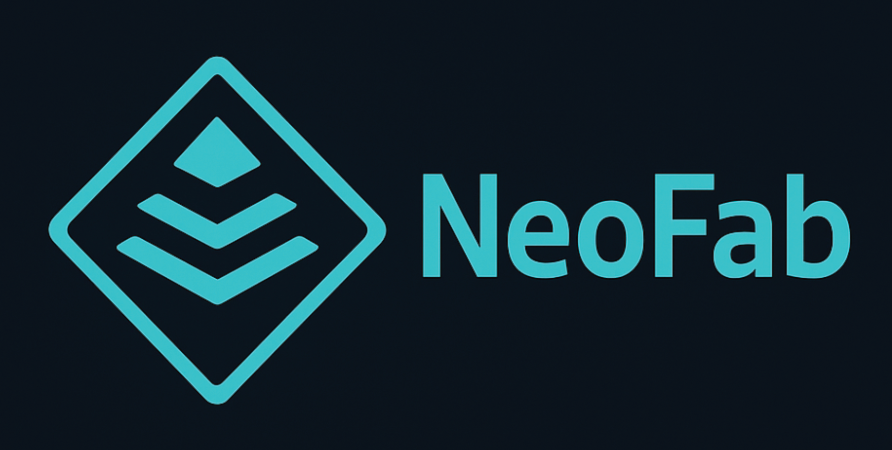

# NeoFab - Multilingual Workshop Order Management System

[Deutsch](README_DE.md)

NeoFab is a Flask-based web application for managing fabrication orders in labs, workshops, maker spaces, and research environments. It supports 3D printing workflows and additional order categories such as plotter, CNC, and procurement work.

The application is built for multilingual use with English as the default language and German and French support through the included translation files.

## Features

- **User accounts and roles**
  Registration, login, self-service password reset, optional email activation, welcome emails, user profiles, admin users, disabled users, and deleted-user handling.

- **3D print order management**
  Structured order data, project metadata, deadlines, approval information, cost centers, and status tracking.

- **Stable order numbering**
  Order IDs are protected against accidental reuse after single-order deletion. Administrators can reset all order data and the order sequence from system settings with explicit safety confirmations.

- **Order categories**
  Orders can be assigned to categories such as 3D print, plotter, CNC, or procurement. The order detail view adapts its tabs and forms to the selected category.

- **Model and file handling**
  Upload and manage 3D models, G-code files, and documentation attachments per order.

- **Plotter poster handling**
  Plotter orders use a dedicated poster tab instead of the 3D model/image tab. Users can upload multiple JPG, PNG, or PDF poster files with notes, quantity, and required print-ready date.

- **Plotter poster cost calculation**
  Plotter poster files can be assigned a paper, plotter type, and poster size. NeoFab analyzes poster coverage and calculates poster line-item costs from paper cost per m2, selected poster area, coverage, machine cost per poster, maintenance cost per poster, quantity, and setup cost.

- **Procurement article workflow**
  Procurement orders use a dedicated article tab. Users can maintain article name, description, supplier, article link, quantity, and unit price including VAT.

- **Procurement note uploads**
  Each procurement article can include an optional note attachment. Supported formats are text files, Word documents, PDF files, and LibreOffice documents.

- **Procurement status automation**
  Admins and workers can set article statuses to ordered or delivered. Procurement order status is updated automatically: any ordered/delivered article sets the order to in progress, and all delivered articles set the order to completed.

- **Poster thumbnails**
  Uploaded poster images show thumbnails in the order view. PDF files show a first-page preview when supported by the runtime, with a PDF fallback preview otherwise.

- **Project videos**
  Orders can include MP4, WebM, OGV, OGG, or MOV videos with an optional short note and a maximum upload size of 200 MB.

- **STL and 3MF viewer**
  Browser-based model preview with reset, grid, axes, labels, wireframe mode, model information, and thumbnail support.

- **Print job tracking**
  Create and manage print jobs with printer, material, color, print status, start time, and print parameters.

- **3D print cost calculation**
  Print jobs can calculate machine, material, quantity, and setup costs from printer profiles, filament materials, G-code metadata, and manually maintained print parameters.

- **G-code metadata extraction**
  G-code uploads can extract print duration, filament length, and filament weight from slicer comments. Missing values can also be filled later when opening an order.

- **Order list summaries**
  Order lists show compact print job status badges for total jobs, jobs in progress, completed jobs, and failed jobs.

- **Configurable dashboard order list**
  The dashboard order list supports combined filters for category, area, and status, a persistent free-text search, saved browser-session filter state, sortable columns, pagination, and system-wide dashboard column visibility and ordering.

- **Integrated messaging**
  Built-in communication between users and admins, persistent read status, and optional email notifications.

- **Notification controls**
  Status emails, welcome emails, activation links, password reset links, SMTP tests, announcements, and high-priority messages can be controlled through the application settings and user preferences.

- **Consistent local time handling**
  UI views, the log viewer, dashboard clock, notification emails, PDF exports, and print job start times use the configured NeoFab local time and UTC-safe storage logic.

- **Admin area**
  Manage users, materials, colors, 3D printer profiles, filament materials, plotter papers, plotter types, cost centers, announcements, training playlists, training videos, logs, and orders.

- **Archiving and cleanup**
  Admins can archive orders and permanently delete orders including database records and related files.

- **Audit and log support**
  Logs include user activity, order changes, archive/delete operations, file cleanup details, and login timing diagnostics. Administrators can optionally enable automatic deletion after a configurable number of days.

## Tech Stack

- Python 3
- Flask
- SQLAlchemy
- Flask-Login
- Werkzeug Security
- Bootstrap 5
- Jinja templates
- SQLite, MariaDB, or PostgreSQL
- Gunicorn and systemd for production deployments

## Project Structure

```text
neofab/
  app.py
  models.py
  notifications.py
  routes/
  static/
  templates/
  version.py
i18n/
  de.json
  en.json
  fr.json
doku/
  SETUP.md
  Version_Timeline.md
script/
  setupNeoFab
  setupNeoFabService
  upDateNeoFabService
  resetAdminPassword
images/
  Logo_NeoFab.png
  NeoFab_V0-8-6_*.jpg
```

## Setup

Installation and maintenance scripts are available in the `script/` directory.

Start with the setup documentation:

- [Script setup guide](script/README.md)
- [General setup notes](doku/SETUP.md)

The main scripts are:

- `script/setupNeoFab` - base installation and optional development server start
- `script/setupNeoFabService` - systemd service setup with Gunicorn
- `script/upDateNeoFabService` - update an existing service installation
- `script/resetAdminPassword` - emergency admin password reset

## Current Version

Current application version: **0.9.50**

Recent changes include plotter master data, default paper per plotter type, poster coverage analysis, and poster cost calculation for plotter orders.

The update script installs Python dependencies from `neofab/requirements.txt`, including PyMuPDF for rendering the first page of uploaded poster PDFs as thumbnails.

See [Version_Timeline.md](doku/Version_Timeline.md) for the detailed project history.

## Screenshots V0.8.6

### NeoFab Home

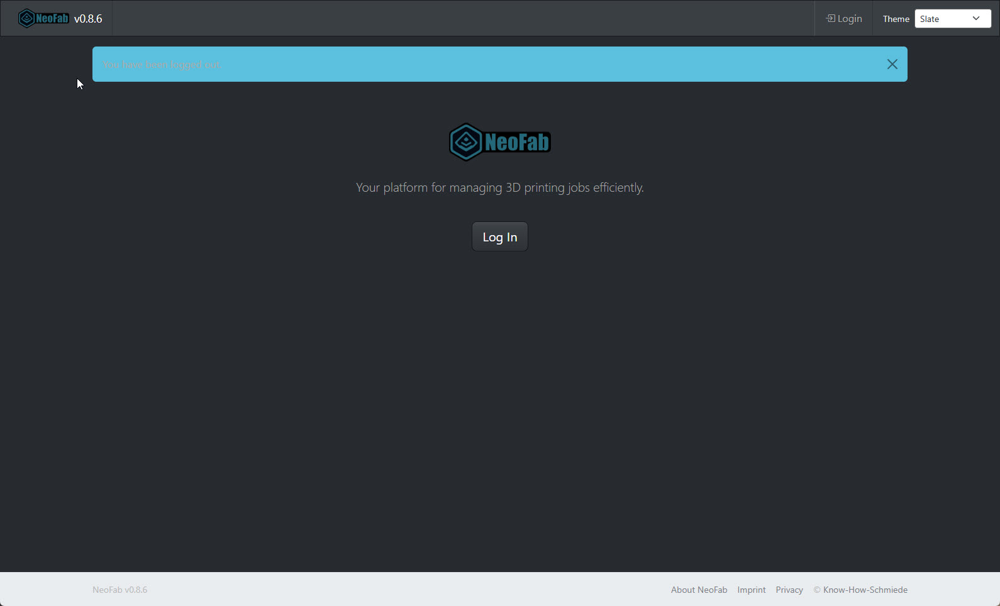

### STL and 3MF Viewer

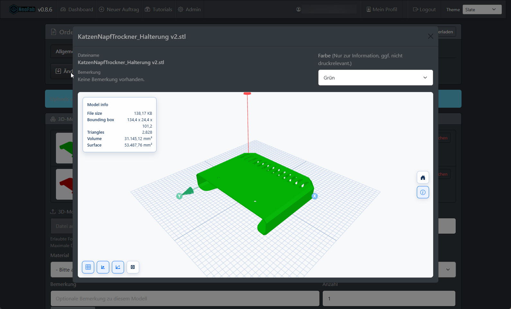

### System Settings

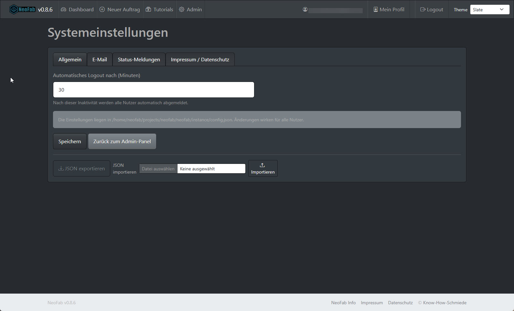

### Admin Panel

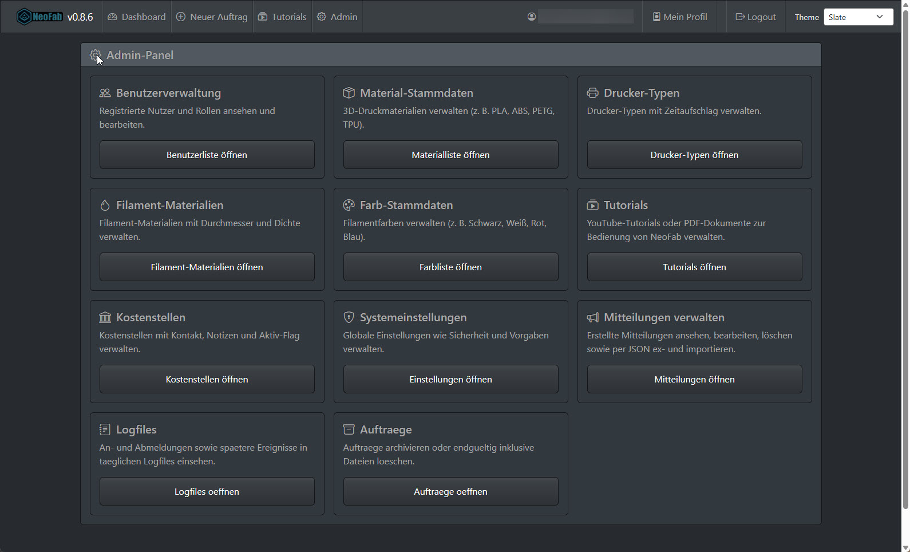

### User Profile

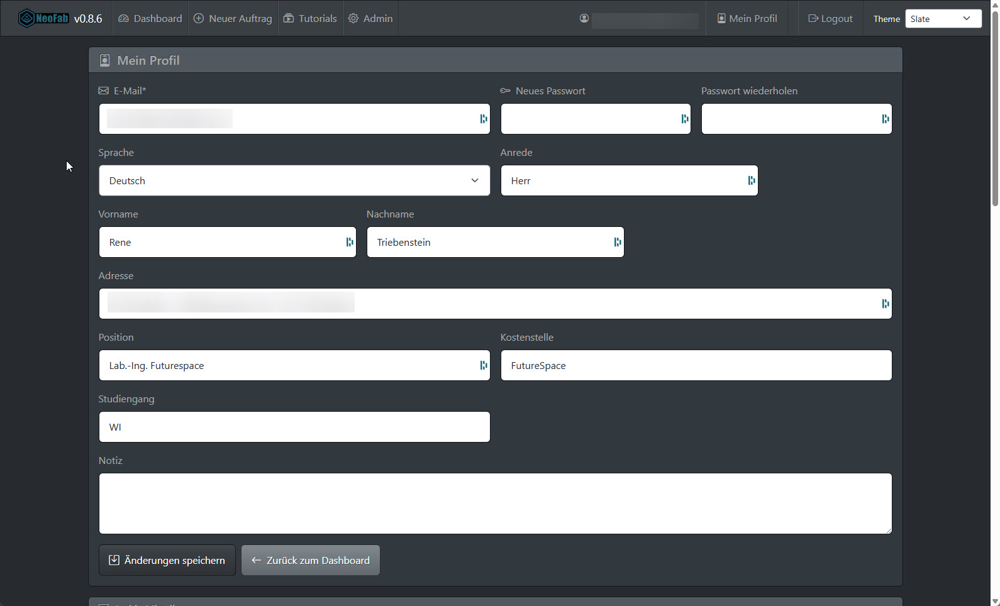

### Communication and Chat

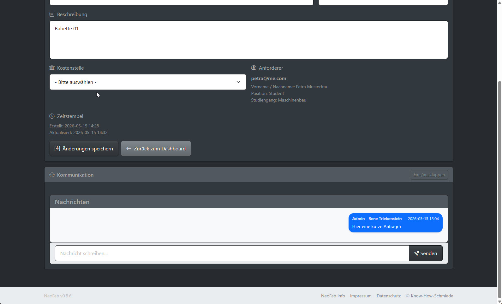

### Order Print Jobs

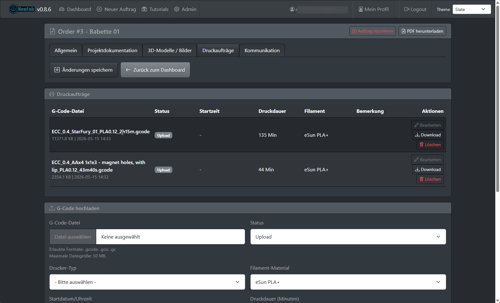

### Order 3D Models

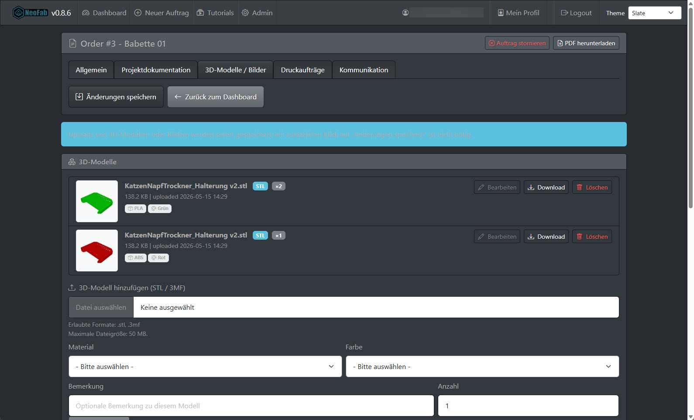

### Order Documentation

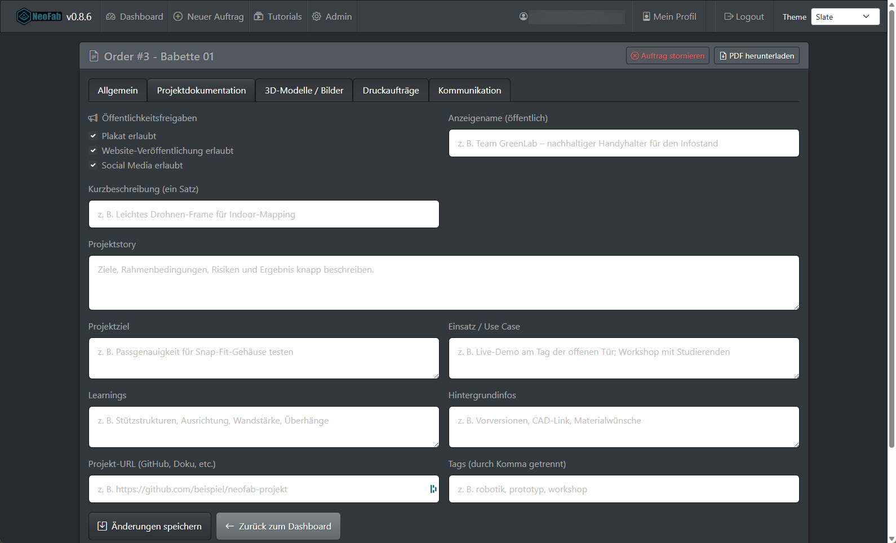

### Order Overview

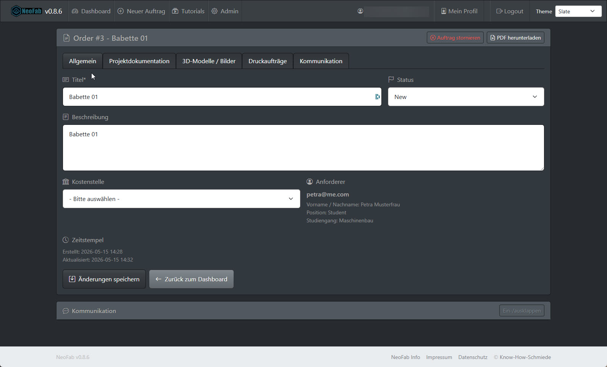

### Order List

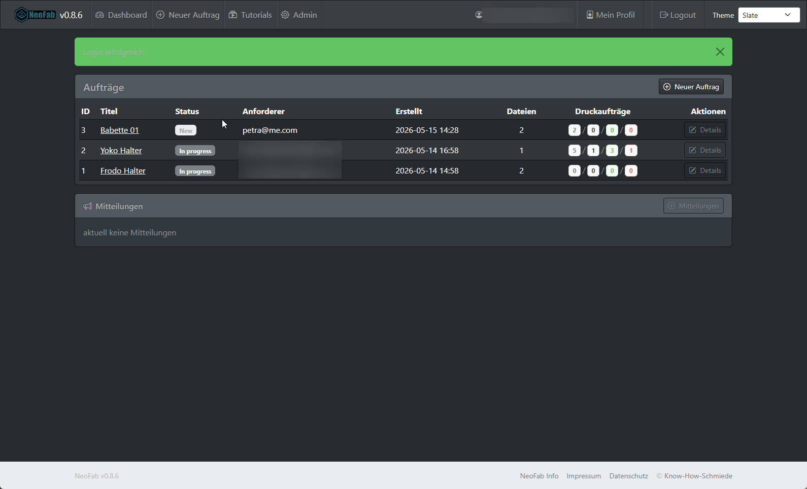

### Login

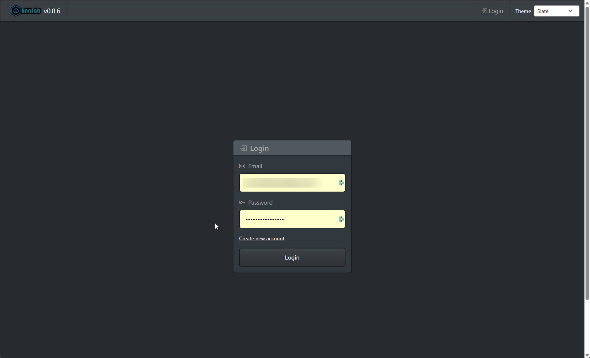

## License

See the included license files for licensing information.
